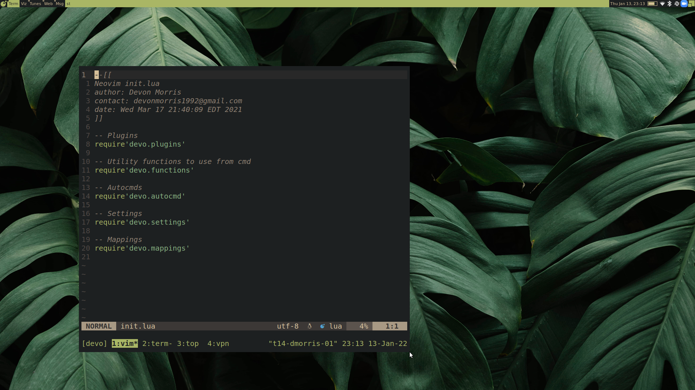

# Configuration Files for Linux systems



## Set Up Script
The following command will install the dotfiles into the `~/.dots` and symlink
into the home directory using `stow`. Note: this will adopt any files you
currently have configured e.g. `.vimrc` instead of overwriting them. To get
my copies, you can go into `~/.dots` and check out my versions or commit your
versions.
```bash
curl -s https://raw.githubusercontent.com/DevonMorris/dotfiles/master/scripts/init_dotfiles.sh | bash
```

## Bash
Check out my `.bashrc` and `.shell.d` folder for bash config.

## Neovim
I personally use [Packer](https://github.com/wbthomason/packer.nvim) as my package manager in neovim.

## Awesome Window Manager
I use [awesome](https://awesomewm.org/) for my window manager. Check out the my `~/.config/awesome/rc.lua`.

## Mirrors
You can find my dotfiles on [github](https://github.com/DevonMorris/dotfiles) and [gitlab](https://gitlab.com/DevonMorris/dotfiles)
